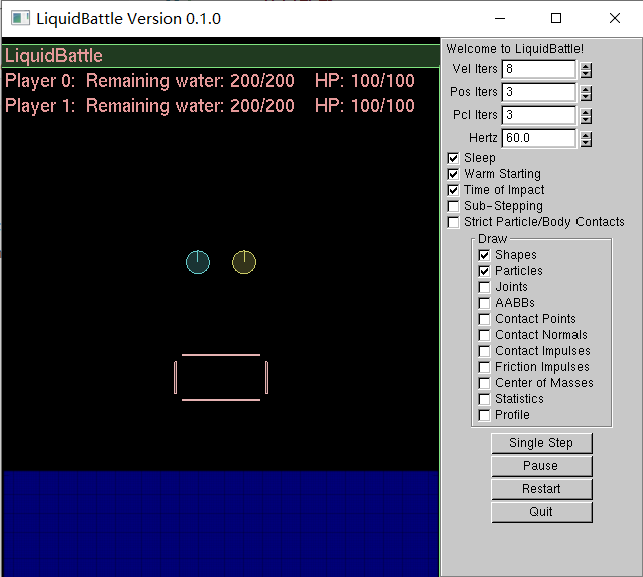

# LiquidBattle

基于 [Google Liquidfun](https://github.com/google/liquidfun) 的 OOP 大作业 **`LiquidBattle`**

作业与文档编写时使用环境为：`Ubuntu 20.04.2 LTS` + `cmake version 3.16.3` + `g++ (Ubuntu 9.3.0-17ubuntu1~20.04) 9.3.0`

经测试兼容的环境：`Win10 21H1 Build 19043.1052 家庭中文版` + `cmake version 3.20.2` + `g++ (x86_64-posix-seh-rev0, Built by MinGW-W64 project) 8.1.0`

### 编译运行指南

在文件目录打开命令行，输入以下命令
```
mkdir build
cd build/
cmake .. -DCMAKE_BUILD_TYPE=Release
make -j LiquidBattle
./LiquidBattle
```
即可编译运行 `Release` 版本

将命令中的 `Release` 替换为 `Debug` 即可编译运行 `Debug` 版本

### 基础要素介绍

<center>
    
</center>

默认情况下，游戏一开始生成两个 `Player`（图中蓝色和黄色圆球） 、一个 `Obstacle`（图中粉色缺角长方形）和一片蓝蓝的海洋。可视界面外有绿色围墙限制游戏区域。

#### `Player`

默认情况下，控制键位如下：

| 控制按键 | 向左转 | 向右转 | 前进（向后喷射） | 后退（向前喷射） |
| :------: | :----: | :----: | :--------------: | :--------------: |
| Player0  |   A    |   D    |        W         |        S         |
| Player1  |   J    |   L    |        I         |        K         |

初始时，每名 `Player` 有 100 点生命值，200 点初始喷射背包容量。

当 `Player` 接触到与自身组别不同的液体时，会按接触量的大小按一定速率扣除生命值，当生命值低于 0 时，游戏暂停，并显示阵亡玩家名单（如下图）。

<center>
    
</center>

`Tips: 单位体积下，其他玩家喷射的液体造成的伤害远高于海水`

玩家通过向后喷射液体产生反冲作用力从而实现向前移动。

喷射出的液体默认将在 5 秒后回收到喷射背包。

#### `Obstacle`

初始时在 `Player` 下方默认生成一个 `Obstacle`，之后每间隔一定时间会在可视区域偏上方随机位置生成 `Obstacle`。

由于 `Obstacle` 是缺角长方形，海水会逐渐渗入内部，逐渐下沉，当接触到游戏区域下边界时被删除。

`Tips: 合理利用浮在水面上的 Obstacle 可以节省喷射背包`

`Warning: 如果 Player 一直飞在上空，有可能会被关在新生成的 Obstacle 里`

### 进阶要素介绍

#### 拓展功能

|     按键     |        功能         |
| :----------: | :-----------------: |
|      Z       |      缩小界面       |
|      X       |      放大界面       |
|      R       | 重新开始（Restart） |
|      P       |    暂停（Pause）    |
| 鼠标左键拖动 |   拖动游戏中元素    |
| 鼠标右键拖动 |  调整可视界面位置   |
|   鼠标滚轮   |    调整界面缩放     |

#### 实验性功能

| 按键 |           功能            |
| :--: | :-----------------------: |
|  =   | 向 0 号玩家组添加一名玩家 |
|  -   |   删除列表最后一名玩家    |

#### `Debug` 模式

当编译选项使用 `Debug` 模式时，游戏界面如下图所示：

<center>
    
</center>

`Debug` 模式下可以进行相应参数的调整和辅助图形的绘制，并会启用调试信息的输出。

`Warning: Debug 模式下性能较低，帧率可能大幅下降`

### 项目目录简介

- `src/`：项目源文件
- `res/`：文档使用的资源（如图片）
- `doc/`：项目说明文档
- `build/`：编译目录
- `liquidfun-gcc9/`：[Google Liquidfun](https://github.com/google/liquidfun)

### 实现细节概要

#### `Ejector` 类

继承自 `src/framework/ParticleEmitter.h` 中的 `RadialEmitter` 类，实现了玩家所使用的喷射背包。

`Ejector` 本质上是一个从单点喷射液体粒子的独立液体系统。一开始时设定玩家喷射背包的方位角，之后的每一帧中，`Ejector` 将计算从该玩家依附的 `Body` 的中心沿该方向出发与边界的交点，将此交点稍向外处作为液体喷射点，向该 `body` 喷射，通过碰撞与反射实现玩家向前运动，液体向后喷射的效果。

`"Feature": 这种实现方法会在 body 运动方向与液体反射出方向相同时出现喷出液体流分叉的效果。`

玩家 `body` 的转向也由 `Ejector` 实现，实现原理为增减 `body` 的旋转角速度。

#### `Player` 类

这是游戏最重要的一个部分，用来接受玩家操作，控制运动，计算伤害，显示玩家信息等。

`Player` 组合了一个 `Ejector` ，对应 `body` 的指针，玩家各类信息（包括当前血量、键盘映射表、颜色等等），以及该玩家的一些参数（扣血速度、初始血量等等）。

在创建 `Player` 时指定键盘映射表从而便于指定每名玩家的按键。

键盘通过在按下和松开时分别设置状态从而实现对长按的响应。

#### `Obstacle` 类

记录 `world` 和 `body` 指针，在析构时从 `world` 中删除对应 `body`。

#### 伤害结算（碰撞记录）

每个 `body` 和 `particleSystem` 创建一个 `CollisionData` 作为 `UserData`，其中记录自己的组别和碰撞次数，每次进行伤害结算时按碰撞次数计算伤害，并将计数清零。

记录碰撞使用 `MyContactFilter` 类，继承自 `b2ContactFilter` ，用于编写发生碰撞时执行的函数。

用户组为一个无符号 32 位整数，该整数二进制下每一位的 0/1 表示是否属于该用户组。

默认情况下，用户组设置如下：

|           元素           | 用户组（前补 0） |
| :----------------------: | :--------------: |
|         初始海洋         |     00000000     |
|        `Obstacle`        |     00000000     |
| `Player0` 及其喷出的液体 |     00000001     |
| `Player1` 及其喷出的液体 |     00000010     |
|          边界墙          |  ~0（即全为 1）  |

可以通过用户组的位运算实现用户组关系的判断，拓展出更多功能。

具体实现细节以及成员变量和成员函数的功能可参见 `doc/` 目录下各文档。