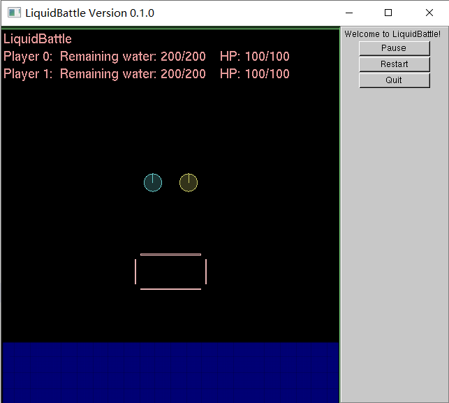
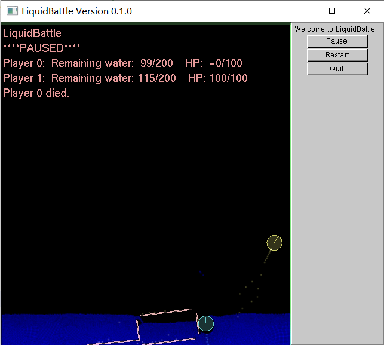

# LiquidBattle

基于 [Google Liquidfun](https://github.com/google/liquidfun) 的 OOP 大作业 **`LiquidBattle`**

作业与文档编写时使用环境为：`Ubuntu 20.04.2 LTS` + `cmake version 3.16.3` + `g++ (Ubuntu 9.3.0-17ubuntu1~20.04) 9.3.0`

经测试兼容的环境：`Win10 21H1 Build 19043.1052 家庭中文版` + `cmake version 3.20.2` + `g++ (x86_64-posix-seh-rev0, Built by MinGW-W64 project) 8.1.0`

### 编译运行指南

在文件目录打开命令行，输入以下命令
```
mkdir build
cd build/
cmake .. -DCMAKE_BUILD_TYPE=Release
make -j LiquidBattle
./LiquidBattle
```
即可编译运行 `Release` 版本

将命令中的 `Release` 替换为 `Debug` 即可编译运行 `Debug` 版本

### 游戏界面介绍

<center>
    
</center>

默认情况下，游戏一开始生成两个 `Player`（图中蓝色和黄色圆球） 、一个 `Obstacle`（图中粉色缺角长方形）和一片蓝蓝的海洋。可视界面外有绿色围墙限制游戏区域。

#### `Player`

初始情况下，控制键位如下：

| 控制按键 | 向左转 | 向右转 | 前进（向后喷射） | 后退（向前喷射） |
| :------: | :----: | :----: | :--------------: | :--------------: |
| Player0  |   A    |   D    |        W         |        S         |
| Player1  |   J    |   L    |        I         |        K         |

初始时，每名 `Player` 有 100 点生命值，200 点初始喷射背包容量。

当 `Player` 接触到与自身组别不同的液体时，会按接触量的大小按一定速率扣除生命值，当生命值低于 0 时，游戏暂停，并显示阵亡玩家名单（如下图）。

<center>
    
</center>

`Tips: 单位体积下，其他玩家喷射的液体造成的伤害远高于海水`

玩家通过向后喷射液体产生反冲作用力从而实现向前移动。

喷射出的液体默认将在 5 秒后回收到喷射背包。